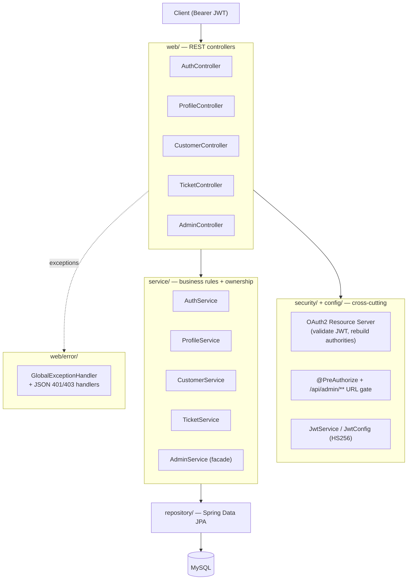
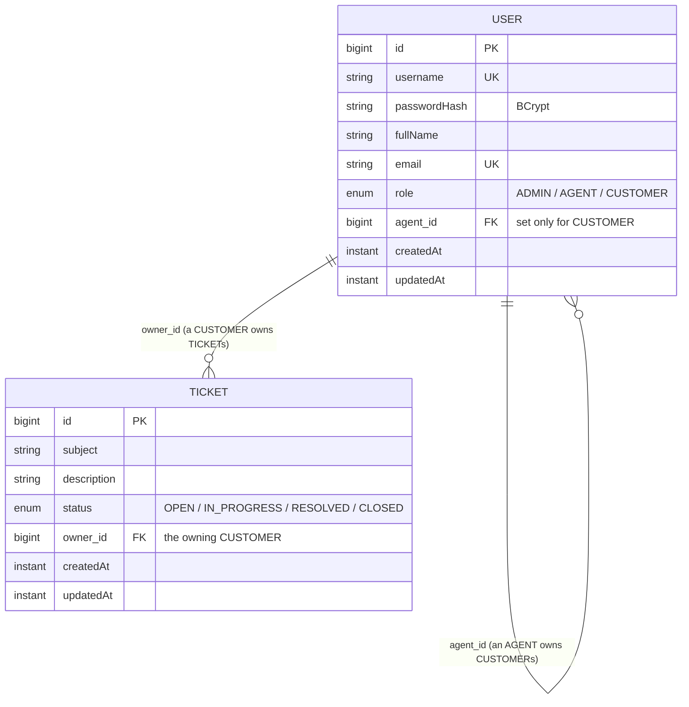
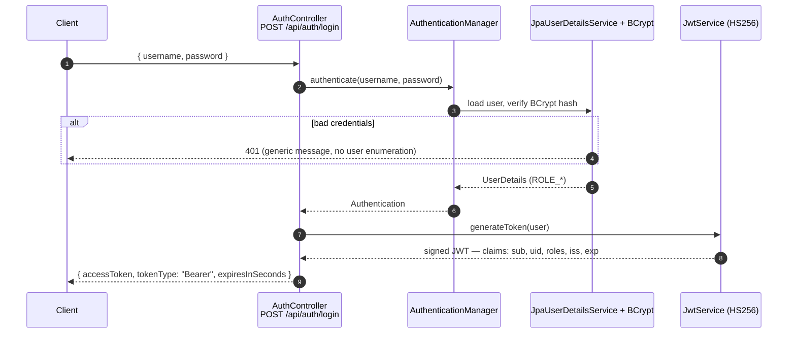
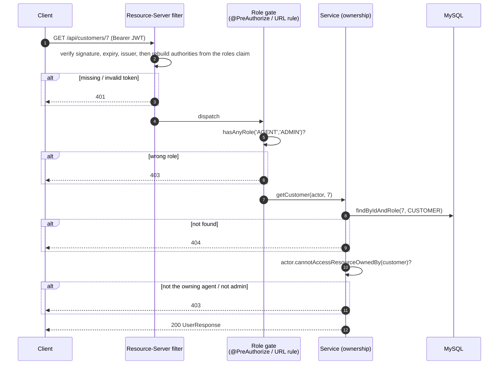
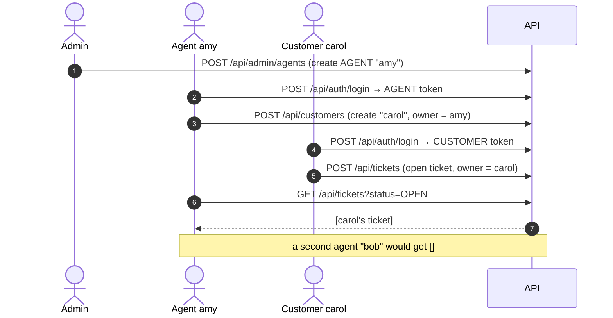

# Submission Notes — Customer Support Hub

This document explains the **design and architecture choices**, the **main request flows** (with
examples and diagrams), and the **deliberate trade-offs and scope boundaries**. For build/run
instructions see [`README.md`](README.md); for runnable end-to-end scenarios see
[`demo/`](demo/).

---

## 1. What it is

A secure, role-based customer-support backend. Three roles — **ADMIN**, **AGENT**, **CUSTOMER** —
with a strict ownership model:

- an **AGENT** owns several **CUSTOMER**s and can only ever see/manage *its own* customers and
  *their* tickets;
- a **CUSTOMER** opens and reads *its own* tickets and manages *its own* profile;
- an **ADMIN** can reach every operation in the system.

Stack: **Spring Boot 3 / Java 21**, **Spring Data JPA over MySQL**, **Spring Validation**, **Spring
Security** (OAuth2 Resource Server + JWT). Built with the priorities the brief calls for —
*correctness, clarity, and trade-off awareness* over feature breadth.

---

## 2. Architecture

A conventional, strictly-layered design. Each layer has one job, and authorization is enforced in
**two complementary places** (coarse role gate at the web edge, fine-grained ownership in the
service).



**Package layout**

| Package | Responsibility |
|---------|----------------|
| `domain/` | JPA entities (`User`, `Ticket`) + enums (`Role`, `TicketStatus`) |
| `repository/` | Spring Data repositories (derived queries + a couple of `default` helpers) |
| `dto/` | Request/response **records** + `ErrorResponse` |
| `service/` | Business logic and **per-record ownership** decisions |
| `security/` | `JwtService` (token minting), `JpaUserDetailsService` (credential lookup) |
| `config/` | `SecurityConfig`, `JwtConfig`, `JwtProperties`, `DataSeeder` |
| `web/` | REST controllers |
| `web/error/` | `GlobalExceptionHandler`, custom exceptions, JSON auth entry-point / access-denied handlers |

---

## 3. Domain model

A **single `users` table** holds all three roles. A CUSTOMER points to its owning AGENT via a
**self-referencing `agent_id`**; a `Ticket` is owned by the CUSTOMER who opened it. This makes
"who can see what" a pure graph walk (`ticket → owner → agent`) and keeps the schema tiny.



`username` and `email` are **unique**; both timestamps are managed by Hibernate
(`@CreationTimestamp` / `@UpdateTimestamp`).

---

## 4. Security & authentication

### 4.1 The login flow

The brief asks to *"use Spring OAuth to authenticate via username/password."* The OAuth2
**Resource-Owner-Password grant was removed in OAuth 2.1** and is unsupported by the current Spring
Authorization Server, so this service takes the modern, supported interpretation: a credentials
endpoint that **mints a JWT**, and an **OAuth2 Resource Server** that validates that JWT on every
other request. (This trade-off is also called out in the README.)



The token carries `sub` (username), `uid`, `roles`, an `iss` of `customer-support-hub`, and an
expiry. It is signed with a symmetric **HS256** secret because a single self-contained service both
issues *and* validates it.

### 4.2 Authorizing a request — two layers

Every protected request passes through the Resource Server filter (signature + expiry + **issuer**
validation, then `roles` → `ROLE_*` authorities), then a **coarse role gate**, then a
**fine-grained ownership check** in the service:



- **Coarse gate** (`@PreAuthorize` on controllers + a URL-level `requestMatchers("/api/admin/**")
  .hasRole("ADMIN")` in `SecurityConfig`) answers *"may this role call this endpoint at all?"*
  The URL gate is defense-in-depth: it holds even if a new `/api/admin` method forgets its
  annotation (proven by `AdminPathSecurityTest`).
- **Ownership** (`User.cannotAccessResourceOwnedBy(owner)` + scoped queries like
  `findByAgent_IdAndRole`) answers *"may this **specific** caller touch this **specific** record?"*
  ADMIN short-circuits to allowed; an AGENT must own the resource; a CUSTOMER only its own.

Filter-chain rejections (401/403) and dispatcher-level exceptions both render the same JSON
`ErrorResponse` via the custom entry-point/handler and the `GlobalExceptionHandler`.

---

## 5. The core business flow (with example)

The canonical scenario — admin provisions an agent, the agent onboards a customer, the customer
opens a ticket, and the agent (but **only** that agent) sees it:



```bash
# 1) admin provisions an agent
TOKEN=$(curl -s -XPOST localhost:8080/api/auth/login -H 'Content-Type: application/json' \
  -d '{"username":"admin","password":"admin"}' | jq -r .accessToken)
curl -XPOST localhost:8080/api/admin/agents -H "Authorization: Bearer $TOKEN" \
  -H 'Content-Type: application/json' \
  -d '{"username":"amy","password":"agent123","fullName":"Amy","email":"amy@x.io"}'

# 2) the agent onboards a customer (owner = the calling agent, no agentId in the body)
AMY=$(curl -s -XPOST localhost:8080/api/auth/login -H 'Content-Type: application/json' \
  -d '{"username":"amy","password":"agent123"}' | jq -r .accessToken)
curl -XPOST localhost:8080/api/customers -H "Authorization: Bearer $AMY" \
  -H 'Content-Type: application/json' \
  -d '{"username":"carol","password":"cust123","fullName":"Carol","email":"carol@x.io"}'

# 3) the customer opens a ticket; 4) the owning agent sees it, a different agent does not
```

The full happy- and unhappy-path matrix (401/403/404/409/400/405/415) is runnable from
[`demo/customer-support-hub.http`](demo/customer-support-hub.http).

---

## 6. Key design decisions & trade-offs

| Decision | Why | Trade-off / note |
|----------|-----|------------------|
| **Custom `/login` + Resource Server** (not the password grant) | The OAuth2 password grant is removed in OAuth 2.1 / unsupported by Spring Authorization Server | Documented; uses OAuth2/JWT machinery for all *validation* |
| **HS256, self-issued JWT** | One self-contained service issues *and* validates | Single secret; rotate via `JWT_SECRET`. The JWS header is set to HS256 explicitly — `NimbusJwtEncoder` otherwise defaults to RS256 and fails to sign |
| **Validate the `iss` claim on decode** | Reject tokens not minted by us, even if a secret leaks to another issuer | Low cost; closes a gap |
| **Single `users` table + self-referencing agent** | Smallest schema that expresses the role graph; ownership = a join walk | All roles share a table; the `agent_id` is null for ADMIN/AGENT |
| **Two-layer authorization** | Separate "who may call this" (role) from "which records" (ownership) | Role lives declaratively (`@PreAuthorize` + URL gate); ownership lives in the service |
| **Lean on DB unique constraints for duplicates** | The constraint enforces uniqueness anyway; Spring maps the violation to **409** | Removed redundant `existsBy*` pre-checks; the 409 message is generic |
| **Keep explicit `NotFoundException`** | `findById` returns an *empty Optional*, not an exception — there is **no** automatic 404 | Removing it would yield 500 (NPE) or a misleading 409, so it stays |
| **Dedicated `/api/admin` only for differently-shaped ops** | Reads/"same op, wider scope" already admit ADMIN on the shared endpoints; duplicating them adds no value | Admin gets new *capabilities* (create agent, ticket-/customer-on-behalf), not duplicate reads |
| **"On behalf of" model** | A ticket is owned by a customer and a customer by an agent, so an admin must *name* the target (`/api/admin/agents/{id}/customers`, `/api/admin/customers/{id}/tickets`) | Keeps the ownership graph intact; admin never *owns* a ticket/customer |
| **`GET /api/customers/{id}` is staff-only** | The brief grants a CUSTOMER only its own *profile* (`/api/users/me`), not a customer-lookup-by-id | A CUSTOMER gets 403 there by design |
| **Stateless (no server-side sessions/revocation)** | Horizontal scalability; nothing to replicate | No token revocation — mitigated by short TTL |
| **`ddl-auto=update`** | Convenience for the exercise | Production would use versioned migrations (Flyway/Liquibase) |
| **Derived queries use `Agent_Id` / `Owner_Agent_Id`** | The underscore forces association traversal (`agent.id`) against the JPA metamodel; `AgentId` clashes with the `getAgentId()` getter and fails at startup | A subtle but real Spring Data pitfall |

---

## 7. Error handling

`GlobalExceptionHandler` extends `ResponseEntityExceptionHandler`, so the standard Spring MVC
exceptions keep their correct statuses instead of collapsing to 500. Every error returns the same
JSON shape: `{ timestamp, status, error, message, path, fieldErrors? }`.

| Situation | Status |
|-----------|:------:|
| Validation failure (`@Valid`) | **400** (with `fieldErrors`) |
| Malformed body / wrong query-param type | **400** |
| Bad credentials / missing or invalid token | **401** |
| Wrong role or not the resource owner | **403** |
| Resource not found | **404** |
| Unsupported method / media type | **405 / 415** |
| Duplicate username/email (DB unique constraint) | **409** |
| Anything unexpected | **500** (logged server-side, generic message to the client) |

---

## 8. Testing approach

- **Unit tests (Mockito)** over the services — ownership/authorization logic, partial updates, and a
  real **HS256 encode/decode round-trip** (`JwtServiceTest`, which guards the RS256-default pitfall).
- **Security-aware `@WebMvcTest` slices** — `401`/`403`/2xx per role, the `/api/admin/**` URL gate,
  the "admin reaches every endpoint" matrix, and correct error statuses.

This is intentionally **fast and database-free** (`mvn test` needs no MySQL), consistent with the
"MySQL only, no H2" constraint — rather than swapping in H2 just for tests. The persistence and
DB-constraint behavior (derived queries resolving, duplicates → 409, `findByIdAndRole` filtering) is
exercised **end-to-end against real MySQL** via Docker Compose and the runnable `demo/` suite. A
natural next step for a production system would be a Testcontainers-backed `@DataJpaTest` to automate
that layer.

---

## 9. Scope boundaries (intentional non-goals)

To stay small and reviewable per the brief, these were consciously left out (each is a small, clean
extension of the existing model):

- **Ticket status transitions** (OPEN → … → CLOSED) — no update endpoint; tickets are created `OPEN`.
- **Admin user update/delete** and **customer→agent reassignment** — admin can *create* and *read*,
  not mutate/remove arbitrary users.
- **Refresh tokens, token revocation/denylist, rate limiting, CORS** — out of scope for the exercise.

"ADMIN can do anything" is therefore scoped to *every operation the system actually exposes*, with
the model-preserving "on behalf of" endpoints filling the gaps a plain admin couldn't otherwise
reach.
